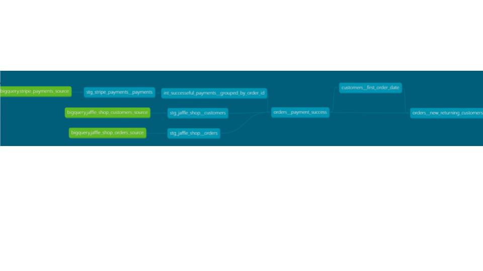

# Jaffle Shop

## 1. Project Name and Description

**Project Name:** Jaffle Shop  
**Description:** This project aims to refactor a SQL query using dbt best practices.

## 2. Problem
This projects aims to refactor a complex SQL query to improve performance and readability while aligning with dbt best practices.

```sql
WITH
paid_orders AS (
  SELECT
    Orders.ID AS order_id,
    Orders.USER_ID AS customer_id,
    Orders.ORDER_DATE AS order_placed_at,
    Orders.STATUS AS order_status,
    p.total_amount_paid,
    p.payment_finalized_date,
    C.FIRST_NAME AS customer_first_name,
    C.LAST_NAME AS customer_last_name
  FROM
    `myprojects-395815.dbt_andrebiel.jaffle_shop_orders` AS Orders
  LEFT JOIN (
    SELECT
      ORDERID AS order_id,
      MAX(CREATED) AS payment_finalized_date,
      SUM(AMOUNT) / 100.0 AS total_amount_paid
    FROM
      `myprojects-395815.dbt_andrebiel.stripe_payments`
    WHERE
      STATUS <> 'fail'
    GROUP BY 1
  ) p ON orders.ID = p.order_id
  LEFT JOIN `myprojects-395815.dbt_andrebiel.jaffle_shop_customers` C ON orders.USER_ID = C.ID
),

customer_orders AS (
  SELECT
    C.ID AS customer_id,
    MIN(ORDER_DATE) AS first_order_date,
    MAX(ORDER_DATE) AS most_recent_order_date,
    COUNT(ORDERS.ID) AS number_of_orders
  FROM
    `myprojects-395815.dbt_andrebiel.jaffle_shop_customers` C
  LEFT JOIN
    `myprojects-395815.dbt_andrebiel.jaffle_shop_orders` AS Orders
  ON
    orders.USER_ID = C.ID
  GROUP BY 1
)

SELECT
  p.*,
  ROW_NUMBER() OVER (ORDER BY p.order_id) AS transaction_seq,
  ROW_NUMBER() OVER (PARTITION BY customer_id ORDER BY p.order_id) AS customer_sales_seq,
  CASE WHEN c.first_order_date = p.order_placed_at THEN 'new' ELSE 'return' END AS nvsr,
  x.clv_bad AS customer_lifetime_value,
  c.first_order_date AS fdos
FROM paid_orders p
LEFT JOIN customer_orders AS c USING (customer_id)
LEFT OUTER JOIN (
  SELECT
    p.order_id,
    SUM(t2.total_amount_paid) AS clv_bad
  FROM paid_orders p
  LEFT JOIN paid_orders t2
  ON p.customer_id = t2.customer_id AND p.order_id >= t2.order_id
  GROUP BY 1
  ORDER BY p.order_id
) x ON x.order_id = p.order_id
ORDER BY order_id
```


## 3. Solution

In order to refactor the query, the best approach is to break down the query into modules.

### Folder Structure

Inside the `my_new_project` directory, we find a directory called 'module'. The 'Module' directory has three layers (sub-directories): Staging, Intermediate, and Marts.

-   **Staging:** This folder contains modules with minimal transformations but without aggregations and joins. The materialization of this layer is set to 'view'.
    
-   **Intermediate:** Modules involving more complex transformations beyond the staging layer are stored here. These modules are also materialized as 'views'.
    
-   **Marts:** The marts layer is where all the modules come together to be materialized as 'tables'.
    
Each layer includes SQL files for modules and YAML files with schema information, descriptions, column names, and applied tests.

## 4. Folder Structure
```
my_new_project/
│
├── module/
│   ├── staging/
│   │   ├── stg_jaffle_shop
│   │   |    ├──  _stg_jaffle_shop__schema.yml
│   │   |    ├──  _stg_jaffle_shop__source.yml
│   │   |    ├──  stg_jaffle_shop__customers.sql
│   │   |    ├──  stg_jaffle_shop__orders.sql
│   │   ├── stg_stripe_payments
|   |   |    ├── _stg__stripe_payments__source.yml
│   │   |    ├── _stg_stripe_payments__schema.yml
│   │   |    ├── stg_stripe__payments.sql
│   ├── intermediate/
│   │   ├── int_jaffle_shop
|   |   |    ├── _int_jaffle_shop__model.yml
│   │   |    ├── int_successeful_payments__grouped_by_order_id.sql
│   ├── marts/
│   |   ├──  marts_jaffle_shop
│   │   |   ├──  _marts_jaffle_shop__schema.yml
│   │   |   ├──  customers__first_order_date.sql
│   │   |   ├──  orders__new_returning_customers.sql     
│   │   |   ├──  orders__payment_sucess.sql
├── dbt_project.yml
└── README.md
```

## 5. Lineage Graph


